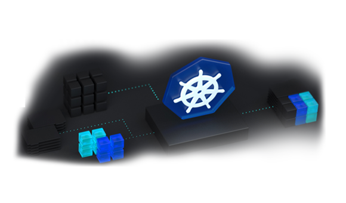

# terraform-akspvtcluster
[](https://docs.microsoft.com/en-us/azure/aks/)

This repo explains and has a template to easily create an AKS "Private" Cluster using terraform.

# _What is AKS?_
Azure Kubernetes Service (AKS) is a managed container orchestration service, based on the open source Kubernetes system, which is available on the Microsoft Azure public cloud. An organization can use AKS to deploy, scale and manage Docker containers and container-based applications across a cluster of container hosts.


# _Use of AKS_
Azure Kubernetes Service (AKS) offers 

* serverless Kubernetes
* an integrated continuous integration and continuous delivery (CI/CD) 
* experience and enterprise-grade security and governance
* Efficient resource utilization
* Faster application development
* Unite your development and operations teams on a single platform to rapidly build, deliver and scale applications with confidence.

## __Azure Kubernetes Service Offering__

Azure aks offers an environment to effectively manage and orchestrate our container based application easily. As the plain Kubernetes setup we still got our master/controlplane and worknode (nodepools) to manage our load.

> Master nodes perform management operations on the cluster and run major part of a control plane. 
> Worker nodes are supposed to run workloads, meaning containers, and they are managed by specific software agents, which are in turn also a part of a control plane.

Now we get the fexbility to choose our very own way to implement our cluster as we have private aks cluster option avaiable publicly now,

1) Public AKS Cluster 
2) Private AKS Cluster

## Difference between public and private aks cluster

AKS gives us the full power without much hassle. So when you provision an cluster the control plane so called management plane or k8s api is public and it can be accessed by internet and this is by defauly and this sort of implementation is called Public AKS Cluster.

In order to implement some hardening around this and increase security to restrict the direct access to the k8s api you can turn on private cluster mode during the creation. So by doing this you can ensure network traffic between your API server and your node pools remains on the private network only.

In this way of implementation the most tempting attack surface cant be blocked. To summaries, 

#### **_benefits_**:

1. The API server is not accessible over the internet at all, blocking any would be attacker from having a endpoint they can try and attack
2. The traffic to the API server is not traversing the internet, removing the risk of a man in the middle or other interception type attack


| Now lets see how to provision a _aks private cluster_ using _terraform_

### _What is terraform? and Why terrafrom?_

#### Terraform:

It is an open source Infrastructure as Code (IaC) tool, which allows us to programmatically provision the infrastructure. 

#### Why Terraform:

Terraform is very simple to use. It follows declarative approach where one can define what they want using a JSON file or HCL (Hashicorp Configuration Language file).

[](https://registry.terraform.io/providers/hashicorp/azurerm/latest/docs/resources/kubernetes_cluster)


:metal:  __Enough said!!! Time to run__ :rocket: :rocket: :rocket: :rocket: :rocket: :rocket:


Download the Terraform files from the GitHub repository to your Shell session and edit the configuration parameters in accordance with your AKS cluster deployment requirements. 

1. Run the following commands to clone the GitHub repository:

```
git clone https://github.com/devopshubproject/terraform-akspvtcluster.git
Cloning into 'terraform-akspvtcluster'...
remote: Enumerating objects: 12, done.
remote: Counting objects: 100% (12/12), done.
remote: Compressing objects: 100% (10/10), done.
remote: Total 12 (delta 1), reused 12 (delta 1), pack-reused 0
Unpacking objects: 100% (12/12), done.
Checking connectivity... done.
```

2. Run the terraform init command to initialize Terraform:

```
terraform init

Initializing the backend...

Initializing provider plugins...
- Finding hashicorp/azurerm versions matching "~> 2.0"...
- Installing hashicorp/azurerm v2.28.0...
- Installed hashicorp/azurerm v2.28.0 (signed by HashiCorp)

Terraform has been successfully initialized!

You may now begin working with Terraform. Try running "terraform plan" to see
any changes that are required for your infrastructure. All Terraform commands
should now work.

If you ever set or change modules or backend configuration for Terraform,
rerun this command to reinitialize your working directory. If you forget, other
commands will detect it and remind you to do so if necessary.
```

3. Run terraform plan and create a plan \-Create the Terraform plan by executing terraform plan -out out.plan.\-

```
terraform plan -out out.plan
Refreshing Terraform state in-memory prior to plan...
The refreshed state will be used to calculate this plan, but will not be
persisted to local or remote state storage.


------------------------------------------------------------------------

An execution plan has been generated and is shown below.
Resource actions are indicated with the following symbols:
  + create

Terraform will perform the following actions:

  # azurerm_kubernetes_cluster.aks will be created
  + resource "azurerm_kubernetes_cluster" "aks" {
      + dns_prefix              = "funapp"
      + fqdn                    = (known after apply)
      + id                      = (known after apply)
      + kube_admin_config       = (known after apply)
      + kube_admin_config_raw   = (sensitive value)
```

4. Use the terraform apply out.plan command to apply the plan.

```
terraform apply out.plan
azurerm_resource_group.aks: Creating...
azurerm_resource_group.aks: Creation complete after 1s [id=/subscriptions/********-****-****-****-************/resourceGroups/cs-rg]
azurerm_virtual_network.aks: Creating...
azurerm_virtual_network.aks: Still creating... [10s elapsed]
azurerm_virtual_network.aks: Creation complete after 15s [id=/subscriptions/********-****-****-****-************/resourceGroups/cs-rg/providers/Microsoft.Network/virtualNetworks/cs-network]
azurerm_subnet.aks: Creating...
azurerm_subnet.aks: Creation complete after 2s [id=/subscriptions/********-****-****-****-************/resourceGroups/cs-rg/providers/Microsoft.Network/virtualNetworks/cs-network/subnets/cs-subnet]
azurerm_kubernetes_cluster.aks: Creating...
azurerm_kubernetes_cluster.aks: Still creating... [10s elapsed]
azurerm_kubernetes_cluster.aks: Still creating... [20s elapsed]
azurerm_kubernetes_cluster.aks: Still creating... [30s elapsed]
azurerm_kubernetes_cluster.aks: Still creating... [40s elapsed]
azurerm_kubernetes_cluster.aks: Still creating... [50s elapsed]
azurerm_kubernetes_cluster.aks: Still creating... [1m0s elapsed]
azurerm_kubernetes_cluster.aks: Still creating... [1m10s elapsed]
```

5. Login into the console to cross verify the provisioned resources.

6. Use terraform destroy to delete the created cluster.


:warning: :firecracker: __NOTE__ :warning: :firecracker:

Since it is a private cluster and the access via internet to the k8s api is blocked as mentioned above, the only way to reach this cluster is via one of the method below:

> Create a VM in the subnet and access the k8s api from that.
> If you happened to be on different Vnet then  virtual network peering is one way to access your private cluster.

To use virtual network peering, you need to set up a link between virtual network and the private DNS zone.

* Go to the node resource group in the Azure portal.
* Select the private DNS zone.
* In the left pane, select the Virtual network link.
* Create a new link to add the virtual network of the VM to the private DNS zone. It takes a few minutes for the DNS zone link to become available.
* In the Azure portal, navigate to the resource group that contains your cluster's virtual network.
* In the right pane, select the virtual network. The virtual network name is in the form aks-vnet-*.
* In the left pane, select Peerings.
* Select Add, add the virtual network of the VM, and then create the peering.
* Go to the virtual network where you have the VM, select Peerings, select the AKS virtual network, and then create the peering. If the address ranges on the AKS virtual network and the VM's virtual network clash, peering fails. For more information, see Virtual network peering.


# Follow-Me

:id: [LinkedIn](https://www.linkedin.com/in/premkumarpalanichamy/)


~~Reference~~
- https://docs.microsoft.com/en-us/azure/aks/private-clusters
- https://docs.microsoft.com/en-us/answers/questions/176414/why-should-we-create-aks-cluster-as-private.html
- https://docs.microsoft.com/en-us/azure/aks/
- https://registry.terraform.io/providers/hashicorp/azurerm/latest/docs/resources/kubernetes_cluster
